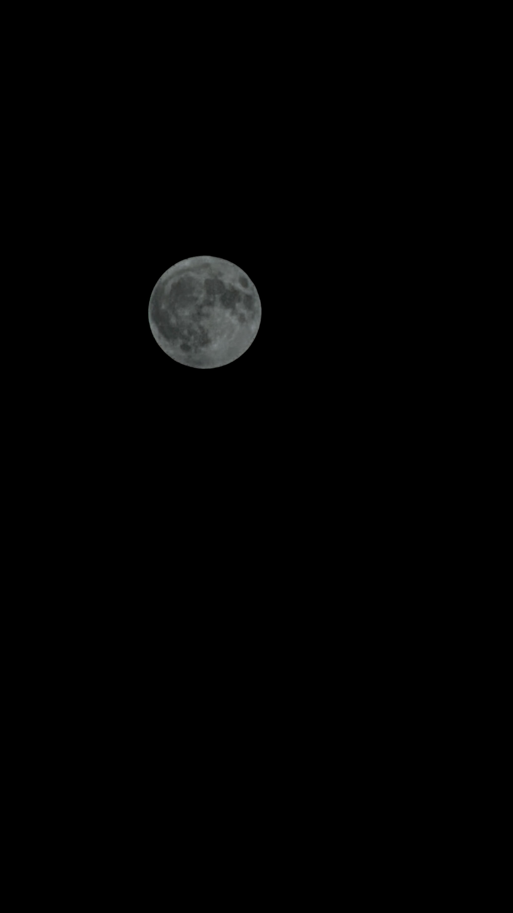
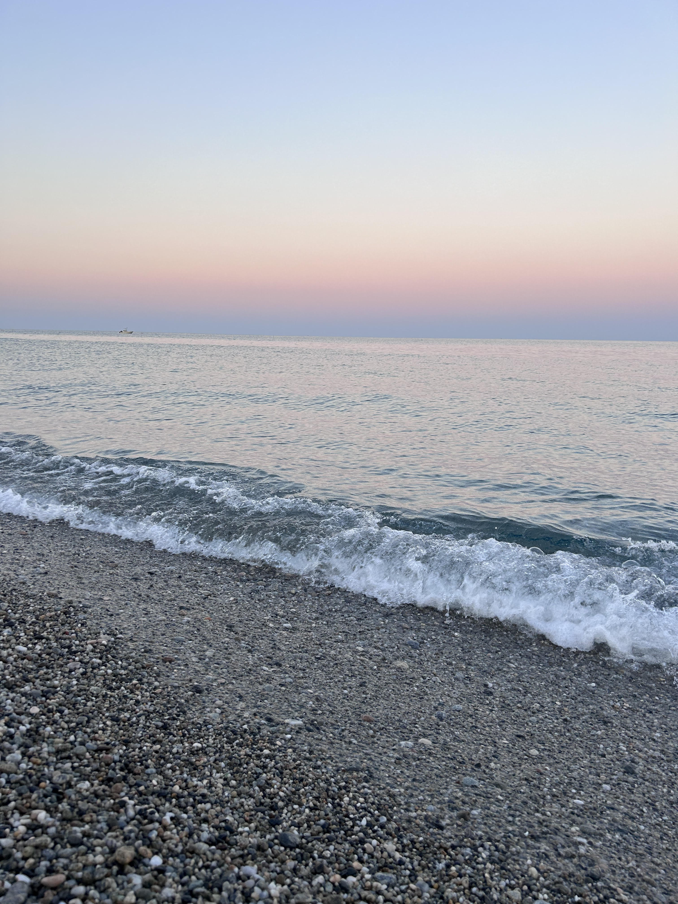
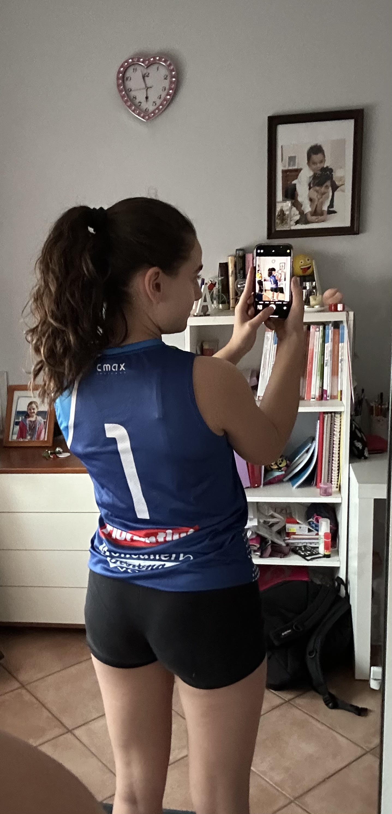
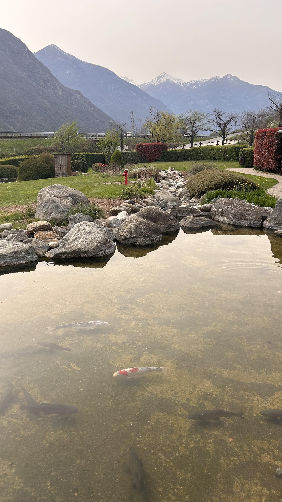
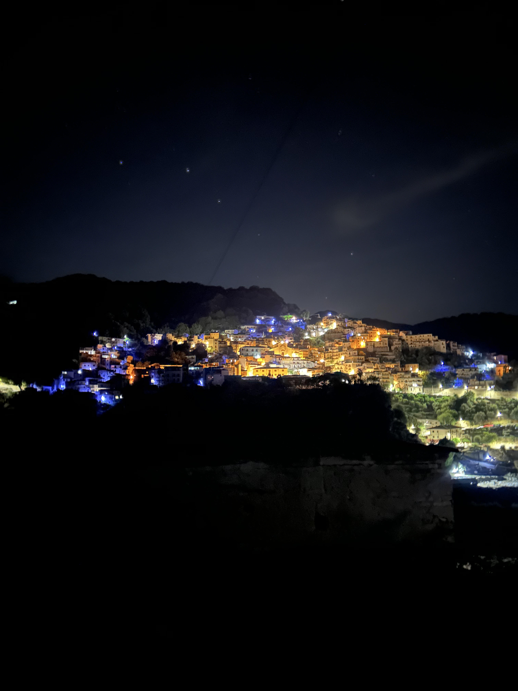

<html>
    <head>
        <title>Scheda Personale</title>
    </head>
    <body>
        <h1 style="text-align:center"> SCHEDA PERSONALE </h1> 
        

            <ul>
                <li>Alice Orlando</li>
                <li>16 anni </li> 
                <li>Inidrizzo informatica all'IIS Maxwell</li>
                <li>Nata 14 settembre 2008</li> 
                <li>Nichelino</li>
            </ul>
        

            Sono cresciuta a Nichelino, sono determina e competitiva,  le mie passione/interessi sono:       
            <ul>
                <li>pallavolo</li>
                <li>viaggiare</li>
                <li>musica/cinema</li>
                <li>fotografia</li>
            </ul>
         
 La pallavolo è in tutti i suoi sensi la mia vita è lo sport che amo e che faccio da 7 anni ormai, nonstante sia pesante conciliare pallavolo e scuola rimane la mia passione preferita; amo viaggiare e anche se non viaggio molto spero di riuscirci quando sarò più grande; amo la musica e il cinema, ogni giorno devo assolutamente sentire le mie canzoni preferite e vado molto spesso al cinema o comunque guardo molti film e serie tv; penso che per me non ci sia cosa più importante della fotografia, amo cogliere ogni attimo della mia vita scattando una foto, infatti ho semore la memoria del telefono piena.  
            Le competenze che ho sviluppato sono:

            <ul>
                <li>sono stata capitano della mia squadra</li>
                <li>le basi della chitarra classica</li>
                <li>so cucire</li>
            </ul>
            
Sono riuscita a diventare capitano della mia squadra l'anno scorso poichè ero la più brava e anche grazie alla mia capacità di leadership; per 4 anni ho fatto chitarra e ho imparato le sue basi; fin da piccola mia nonna mi ha trasmesso la passione per la moda e il cucito difatti mi ha insegnto molto del suo mestiere da sarta. 
        

        

            Il mio obbiettivo principale è quello di andare bene a scuola mi piace studiare e apprendere, per questo spero di ottenere buoni voti, in più un'altro obbiettivo è quello di diventare libero titolare della mia nuova squadra visto che sono entrata in prima divisione.
             Spero tanto, finita la scuola, di riuscire a entrare in università e lavorare allo stesso tempo.
        

        
 
            <b>La mia citazione preferita è:</b> <i>"tu hai la stoffa per compiere grandi imprese, ma devi prendere in mano il timone e tracciare la tua rotta, e devi seguirla, anche in caso di burrasca... E quando verrà il momento in cui potrai mettere alla prova la qualità delle tue vele e mostrare di che pasta sei fatto, beh, spero di essere lì, a godermi lo splendore della luce che emanerai quel giorno.”</i> 
            È tratta dal film <i><b>"il pianeta del tesoro"</b></i> rappresenta esattamente il mio pensiero, essendo io una persona ansiosa questa frase mi ricorda che non bisogna mai arrendersi e combattere fino all'ultimo.
        

        

            le foto che mi rappresentano sono molte ma in queste mi ci rivedo in ogni dettaglio:   
Mi rivedo molto nella luna solitaria ma allo stesso tempo circondata da altre migliaia di stelle;
    
Stessa cosa per il mare però lo trovo così immenso da potermici perdere dentro, lo trovo magnifico;
   
Come ho detto prima, la pallavolo è tutta la mia vita è la mia libertà;
    
La montagna anche essa è parte della mia vita come il mare, io sono cresciuta in questi due ambienti completamente diversi poichè mia mamma è Calabrese e mio papà è Valdostano;
 
Antonimina è il mio paesaggio preferito in assoluto, mi ci rivedo perchè è sempre illuminata sembra quasi un cielo stellato.

        

    </body>
</html>
